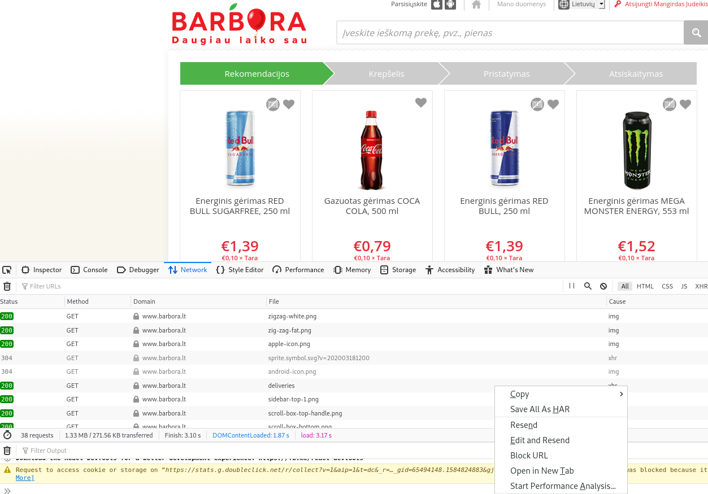

# This project was done as a test and should not be used in production.
# Project is published for visibility only

Authors do not take any legal or financial responsibility.

1. Visit www.barbora.lt
2. Login, create a cart until you good to check-out
3. Enter devtools (F12)
4. Choose Network tag
5. Choose a delivery address/pickup in website
GET (https://www.barbora.lt/api/eshop/v1/cart/deliveries)

6. Check devtools, right click on any line and select "Save all as HAR"
7. Put HAR file in the same directory where you executing from
8. run `go run ./cmd {file}`
OR if you dont have any golang installed, I build a binary for all platforms!
```
./bin/order-linux-386 www.barbora.lt_Archive\ \[20-03-22\ 09-30-12\].har

for windows:

./bin/order-windows-386 www.barbora.lt_Archive.har
```
9. File need to be updated daily, as password expired each 24h.
